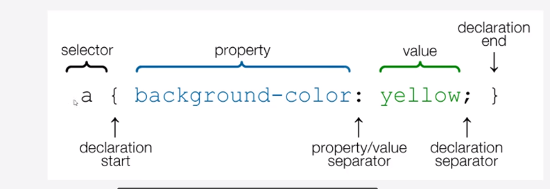
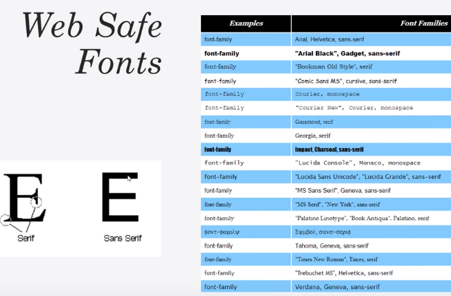
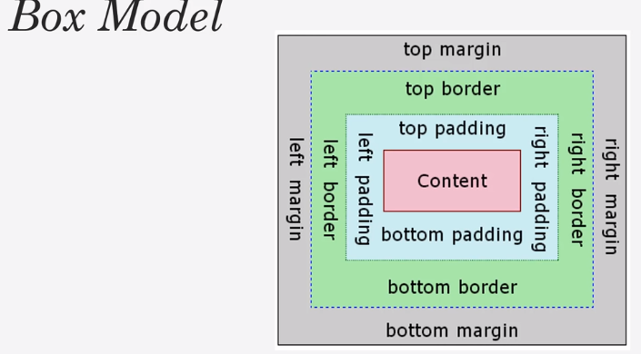

## CSS Notes
- CSS selectors

- Colors in CSS:
  - Color names, HTML5 color names, Hexadecimal, RGB
  ```css
  body {
      color: red;
      background: coral;
  }

  h1 {
    color: #00ff00;
  }

  p {
      color: rgb(0, 0, 255);
  }
  ```
- Web Safe Fonts

- IDs should always be unique and classes can be reused. (classes are recommended)
- Box model
```css
p {
  margin-top: 5px;
  margin-bottom: 5px;
  margin-right: 10px;
  margin-left: 10px;
}

/* top-right-bottom-left */
p {
  margin: 5px 10px 5px 10px;
}

/* top & bottom: 5px(the same)  left & right: 10px */
p {
  margin: 5px 10px
}
```

- Positioning
  - Static, Relative, Absolute, Fixed, Initial, Inherit